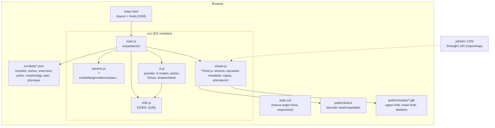
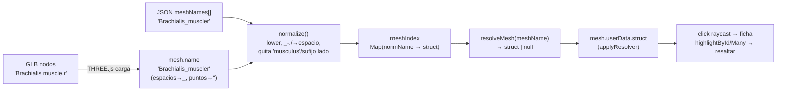
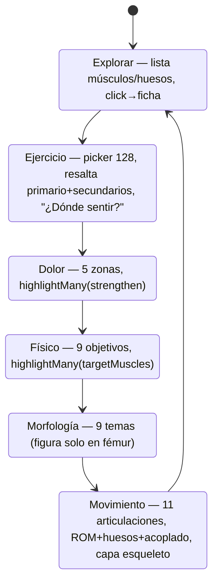
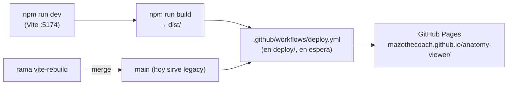
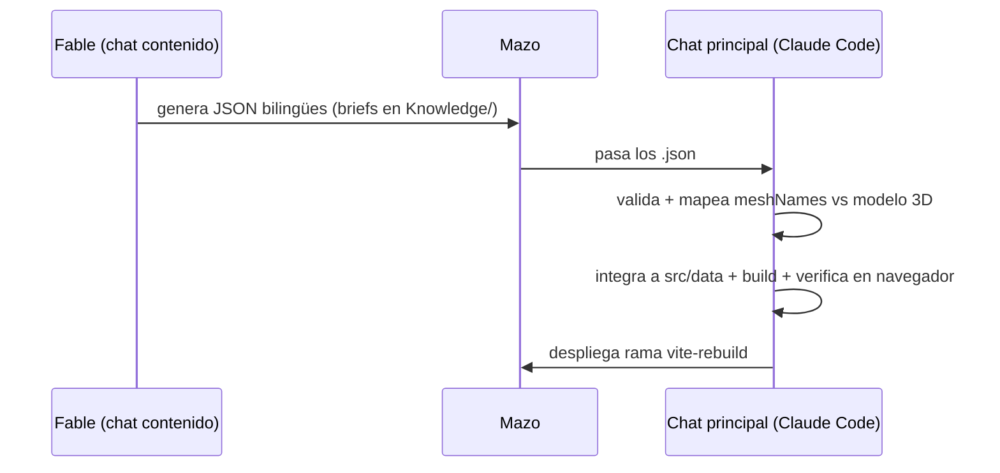

# SPEC — Visor Anatómico 3D (Mazothecoach)

> Especificación técnica ultra-detallada del proyecto **hasta 2026-06-11**.
> Repo: `github.com/mazothecoach/anatomy-viewer` · Rama activa: `vite-rebuild` · Stack: Vite + Three.js.

---

## 1. Resumen ejecutivo

Herramienta web educativa que muestra el cuerpo humano en 3D. El usuario selecciona un **músculo**, **hueso**, **ejercicio** o **articulación** y la app resalta la estructura en el modelo y muestra su ficha: qué hace, dónde está, en qué posición de la curva de fuerza trabaja, y **dónde lo debería sentir el cliente**. Anclada a **PRE-SCRIPT Level 1** (Dr. Jordan Shallow). Bilingüe ES/EN. Dos audiencias (coach / cliente). Embebible en Notion y en la web de Mazothecoach.

- **No** es contenido médico/clínico — educativo de entrenamiento de fuerza (hipertrofia, técnica, prevención de molestias comunes).
- **Marca**: fondo negro `#0a0a0a`, acento verde lima `#c6ff3d`; zonas de curva de fuerza: acortado lima, medio ámbar `#ffb84d`, alargado azul `#6ad1ff`.

---

## 2. Arquitectura



**Principio de diseño**: `viewer.js` no conoce el dominio (anatomía); `main.js` inyecta un *resolver* malla→estructura. `ui.js` solo pinta DOM. Los datos son JSON puros bilingües. Sin backend.

---

## 3. Stack técnico

| Capa | Tecnología |
|---|---|
| Render 3D | Three.js 0.160 (importmap desde jsDelivr) · GLTFLoader · DRACOLoader (decoder autohospedado en `/public/draco/`) · OrbitControls · Raycaster |
| Build | Vite 5 (`base: '/anatomy-viewer/'`), salida estática `dist/` |
| Hosting | GitHub Pages (cuenta `mazothecoach`) |
| Datos | JSON locales, importados estáticamente; sin red en runtime |
| i18n | Capa propia, claves ES/EN por registro `{ es, en }` |
| Compresión de modelos | `@gltf-transform/cli` (Draco) — instalado global |

---

## 4. Estructura del repo

```
anatomy-viewer/
├─ index.html                 # entrada Vite: topbar (modos, toggles), sidebar, canvas, panel, footer
├─ vite.config.js             # base '/anatomy-viewer/', outDir dist
├─ package.json / lock        # deps: three; dev: vite
├─ ATTRIBUTION.md             # crédito Z-Anatomy / AnatomyTool (CC BY-SA)
├─ README.md
├─ SPEC.md                    # este documento
├─ Anatomy_Viewer.html        # LEGACY prototipo de 1 archivo (sirve en main hoy)
├─ models/                    # legacy regionales (raíz)
├─ public/
│  ├─ models/                 # sample.glb(=upper), lower-limb.glb, overview-skeleton.glb
│  └─ draco/                  # draco_decoder.{js,wasm}, wrapper
├─ src/
│  ├─ main.js                 # orquestación, resolver, carga, wiring de modos
│  ├─ viewer.js               # createViewer(): 3D
│  ├─ ui.js                   # render* + wireControls()
│  ├─ i18n.js                 # setLang/t/tf/applyStaticStrings
│  ├─ params.js               # params, validLang, validMode
│  ├─ style.css               # marca + responsive + modos embed
│  └─ data/
│     ├─ muscles.json (56)    # con meshNames mapeados (48)
│     ├─ bones.json (21)      # con meshNames mapeados (21)
│     ├─ exercises.json (128)
│     ├─ joints.json (11)
│     ├─ morphology.json (9)
│     ├─ painZones.json (5)
│     ├─ physiqueGoals.json (9)
│     └─ SCHEMA.md
├─ deploy/                    # workflow de Pages "en espera" (fuera de .github)
│  ├─ deploy.yml
│  └─ README.md
└─ .claude/launch.json        # dev server para preview
```

---

## 5. Modelo de datos

```mermaid
erDiagram
  MUSCLE ||--o{ EXERCISE : "primaryMuscle / secondaryMuscles"
  MUSCLE }o--o{ PAINZONE : "strengthen[]"
  MUSCLE }o--o{ PHYSIQUEGOAL : "targetMuscles[]"
  BONE }o--o{ JOINT : "bones / fixedBone / movingBones"
  BONE }o--o{ BONE : "articulations[]"
  MUSCLE ||--o{ MESH : "meshNames[]"
  BONE ||--o{ MESH : "meshNames[]"

  MUSCLE {
    string id PK
    array meshNames
    string layer "muscle"
    string region "shoulder|arm|core|hip|thigh|leg"
    i18n name location origin insertion action function innervation
    obj forceCurve "shortened|mid|lengthened"
    i18n pslNotes
    array exercises painZones physiqueGoals
  }
  BONE {
    string id PK
    array meshNames
    string layer "bone"
    string region "+axial"
    i18n name location function notes
    array articulations
  }
  EXERCISE {
    string id PK
    i18n name whereToFeel
    string primaryMuscle FK
    array secondaryMuscles FK
    string loadedZone "shortened|mid|lengthened"
    string region equipment
  }
  JOINT {
    string id PK
    i18n name type coupledMotion notes
    array bones FK
    array movements "name,romDeg,plane,fixedBone,movingBones"
  }
  MORPHOLOGY {
    string id PK
    i18n name summary
    obj long "label,note"
    obj short "label,note"
  }
  PAINZONE {
    string id PK
    i18n name rationale
    array strengthen FK
  }
  PHYSIQUEGOAL {
    string id PK
    i18n name rationale
    array targetMuscles FK
  }
```

**Conteos actuales**: 56 músculos · 21 huesos · 128 ejercicios · 11 articulaciones · 9 morfologías · 5 zonas de dolor · 9 objetivos físicos. Todo bilingüe `{ es, en }`. Referencias cruzadas verificadas (ejercicios→músculos, joints→huesos, dolor/físico→músculos).

### Regiones
- Músculos/ejercicios: `shoulder · arm · core · hip · thigh · leg`.
- Huesos añaden `axial` (cráneo, columna, tórax).

---

## 6. Pipeline de mapeo malla → estructura (clave del proyecto)

El reto: conectar los JSON (independientes del modelo) con las mallas del `.glb`.



- **Transformación THREE** (empírica, validada): `name.replace(/ /g,'_').replace(/\./g,'')`. Ej: `"Humerus.r"` → `"Humerusr"`, `"Cervical vertebra (C4)"` → `"Cervical_vertebra_(C4)"`.
- **normalize()** en `main.js`: minúsculas, `[_\-./]`→espacio, quita prefijo `musculus/os/m/the`, quita sufijo de lado `dexter/sinister/left/right/l/r`.
- **Gotcha resuelto**: regex con `\b` final falla con la `r` pegada (`"Supinatorr"`, `"Radiusr"`) → usar substring + filtro de exclusión.

### Estado del mapeo
| Tipo | Mapeados | Notas |
|---|---|---|
| Músculos | **48/56** | 22 tren superior (upper-limb) + 26 inferior (lower-limb). Faltan los **8 del core** (no hay modelo de tronco con nombres). |
| Huesos | **21/21** | Mapeados contra los 3 modelos con filtro de exclusión de tejidos/músculos. |

---

## 7. Modelos 3D

| Modelo | Archivo | Mallas | Contiene | Nombres |
|---|---|---|---|---|
| Miembro superior | `sample.glb` | 532 | brazo + antebrazo + cintura escapular + tórax óseo | ✅ AnatomyTool |
| Miembro inferior | `lower-limb.glb` | 452 | cadera + muslo + pierna + pelvis | ✅ AnatomyTool |
| Esqueleto | `overview-skeleton.glb` | 144 | cuerpo completo, solo huesos | ✅ AnatomyTool |
| Cuerpo completo | (superior+inferior combinados en escena) | ~984 ×2 con espejo | tren superior + inferior | ✅ |
| **Z-Anatomy Myology** | (descargado, NO integrado) | 281 | cuerpo completo **con abdomen** | ❌ `Object_N` (Sketchfab borró nombres) |

Licencia: **CC BY-SA 4.0** (Z-Anatomy / AnatomyTool, derivados de BodyParts3D). Crédito visible en el footer (obligatorio).

---

## 8. API de módulos

### `viewer.js` — `createViewer(canvas, { onSelect, isMobile })`
```
loadModel(url, opts)           loadModels(urls, {mirror})   applyResolver(fn)
setLayer('muscle'|'bone')      isolateRegion(pred)          clearIsolation()
setHideVessels(bool)           setFlex(deg)                 teardownFlex()
reset()  fit()  frameModel()
highlightMesh(m)  highlightById(id)  highlightMany(ids)  clearHighlight()
getMeshNames()  hasModel()
```
- Raycaster con umbral click-vs-drag sensible a `pointerType` (4px ratón / 12px táctil), captura de puntero, guard multitáctil.
- `highlightMany`: tiñe N mallas (Map malla→material original), dim del resto, libera materiales temporales.
- `loadModels(..., {mirror})`: carga varios `.glb` en un grupo; `mirror` clona con `scale.x = -1` (DoubleSide) para **ambos lados**.
- Articulación básica (sin rig): `setFlex` reparenta lo que está bajo la rodilla a un pivote y rota (solo modelo de una pierna).
- Vasos/nervios: `VESSEL_RE` (arterias, venas, plexos, raíces) + `setHideVessels`.

### `ui.js`
```
renderInfo(struct, meshName)          renderHighlightSummary(item, byId, missing)
renderMorphology(item)                renderExercise(ex, byId)   renderJoint(joint, byId)
buildList / setActiveListItem / applySearchFilter / buildRegionTabs / renderPickerList
wireControls({...}) → { setMode, getMode, repaintViewBtn, closeDrawer }
openInfoPanel / closeInfoPanel / setStatus / showEmpty / showProgress / applyStaticStrings
```

### `i18n.js`
`getLang · setLang · toggleLang · t(key) · tf({es,en}) · applyStaticStrings()`

### `params.js`
`params {lang,mode,compact,minimal,region,model,bg} · validLang · validMode`

---

## 9. Los 6 modos



| Modo | Datos | Resaltado 3D | Panel |
|---|---|---|---|
| **Explorar** | muscles + bones | mesh clickeado | ficha completa (origen, inserción, acción, función, inervación, curva, notas PSL) |
| **Ejercicio** | exercises | primario + secundarios | músculo objetivo, zona cargada (glifo), secundarios, "¿Dónde sentir?" |
| **Dolor** | painZones | strengthen[] juntos | rationale PSL + chips |
| **Físico** | physiqueGoals | targetMuscles[] juntos | rationale + chips |
| **Morfología** | morphology | — | 2 variantes (long/short) + notas; figura de sentadilla solo en `femur_length` |
| **Movimiento** | joints | huesos de la articulación (capa esqueleto) | ROM por movimiento (medidor de ángulo), huesos que se mueven, movimiento acoplado |

---

## 10. Parámetros de URL (embed)

| Param | Efecto |
|---|---|
| `?model=URL` | carga ese `.glb` |
| `?lang=es\|en` | idioma inicial |
| `?mode=client\|coach` | vista inicial (cliente oculta lo técnico) |
| `?compact=1` | oculta sidebar izquierdo |
| `?minimal=1` | solo 3D + ficha flotante |
| `?region=<id>` | filtro de región inicial |
| `?bg=<hex>` | fondo |

Uso típico Notion: `…/anatomy-viewer/?compact=1` o `?mode=client&lang=es`.

---

## 11. Build & deploy



- **Estado**: la app Vite vive en `vite-rebuild`; `main` sirve el prototipo de 1 archivo. El workflow de Actions está **staged** en `deploy/` (el token gh no tenía scope `workflow`).
- **Cutover pendiente**: re-auth `gh auth refresh -s workflow` → mover `deploy.yml` a `.github/workflows/` → merge a `main` → Settings→Pages→Source = "GitHub Actions". Preservar legacy en `public/legacy/`.

---

## 12. Flujo de contenido (dos chats)


- Briefs: `Knowledge\FICHAS_BRIEF.md` (músculos), `Knowledge\MORPHOLOGY_BONES_BRIEF.md` (huesos/morfología/joints/ejercicios).
- **Tip**: encuadrar prompts de Fable como "educativo de entrenamiento, no médico" para evitar exceso de cautela.

---

## 13. Estado de verificación

Verificado en navegador (dev server + DOM + screenshots):
- ✅ Carga de modelos (532/452/144 mallas) sin errores de consola.
- ✅ Raycaster click→ficha; resaltado simple y múltiple.
- ✅ 6 modos operativos con sus datos.
- ✅ i18n ES↔EN, vista coach/cliente, ambos lados (espejo simétrico), cuerpo completo (48 músculos a la vez), ocultar vasos.
- ✅ URL params (compact, minimal, mode, lang, bg).
- ✅ Huesos clickeables con ficha; ejercicios con "dónde sentir"; movimiento con ROM.

---

## 14. Pendientes / roadmap

| Prioridad | Item | Bloqueo |
|---|---|---|
| Alta | **Abdomen/core** (8 músculos) | Necesita modelo con nombres (Z-Anatomy "Original format" FBX, o export Blender) |
| Alta | **Animación real del movimiento** | Rig usando `joints.json` (fixedBone/movingBones/romDeg); hoy es informativo |
| Media | **Cutover a Pages** (Actions) | re-auth gh con scope `workflow` + merge |
| Media | **Secundarios completos** en los 128 ejercicios | prompt entregado a Fable |
| Baja | Marcar origen/inserción en 3D | requiere capa "Muscular insertions" de Z-Anatomy |
| Baja | Quizzes / repetición espaciada | feature nueva |

---

## 15. Riesgos / gotchas conocidos

- **Sketchfab borra nombres** en glTF auto-convertido (`Object_N`) → inservible para mapear. Único camino con nombres: export desde Blender / Original format.
- **THREE renombra mallas** al cargar → mapear siempre contra el nombre post-transform.
- **Articulación sin rig** se desbarata con dos piernas/espejo → el slider de flexión se limita a una pierna.
- **Performance**: cuerpo completo + espejo = ~1968 mallas; screenshots headless pueden timeoutear (el render real va bien).
- **Atribución CC BY-SA** es requisito legal — mantener el crédito visible.

---

*Generado 2026-06-11. Fuente de verdad del estado del proyecto a esta fecha.*
